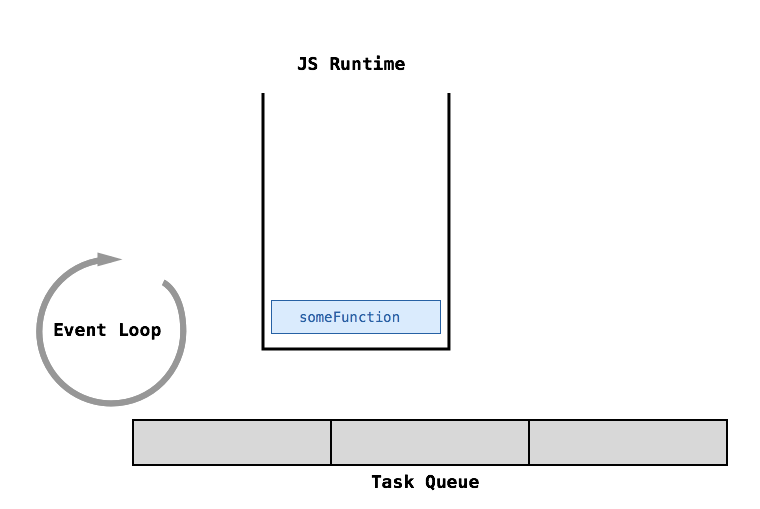
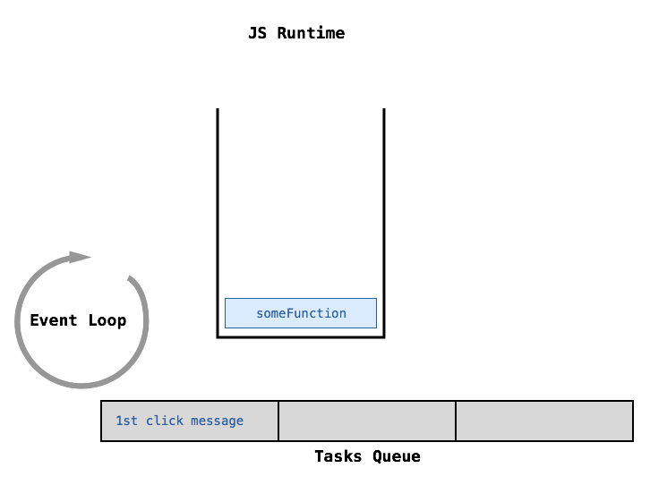
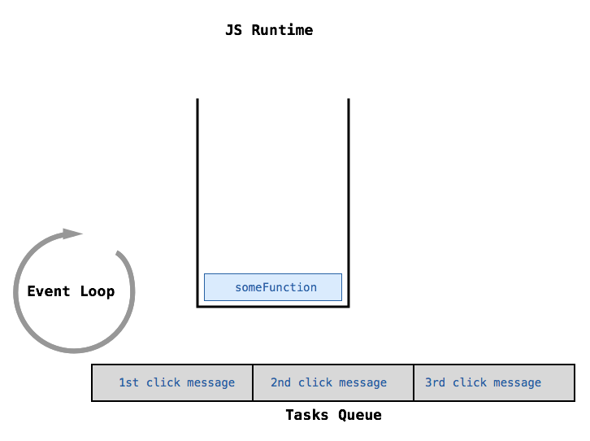
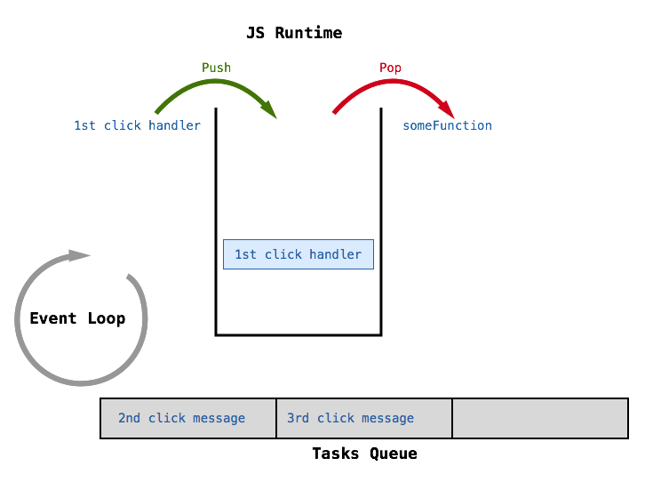
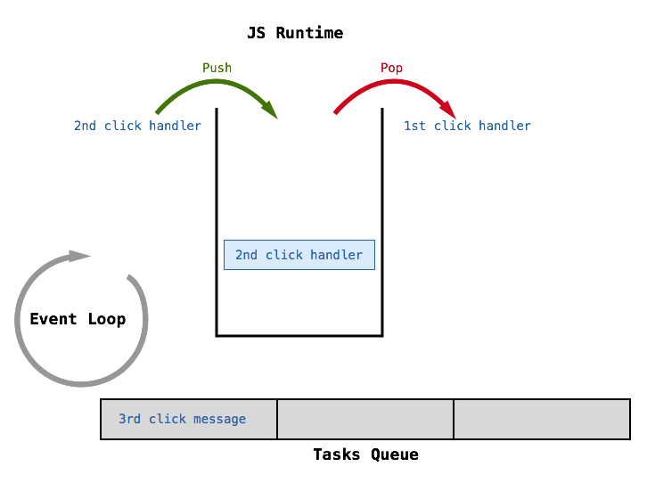
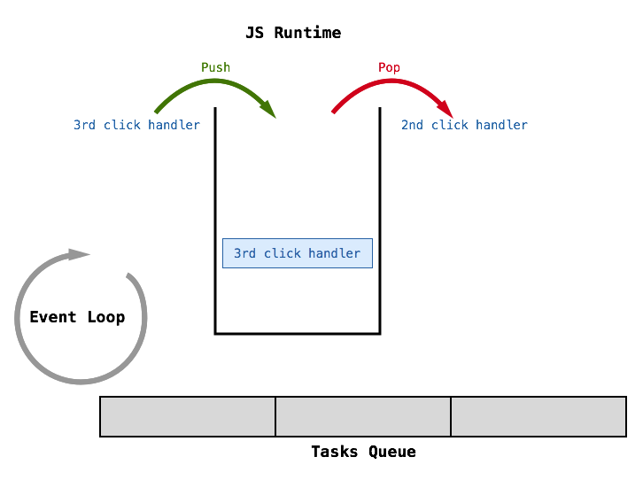
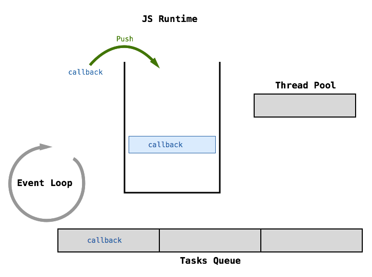

# The JavaScript Concurrency Model
It is said that JavaScript has a **concurrency model** based on an **event loop**. Cool, first of all, what is **concurrency**?

## Concurrency
In computer science, [concurrent computation][1] is a form of computing in which several computations are executing at the same time instead of sequentially (one completing before the next starts). In a concurrently implemented system a computation can make progress without waiting for all other computations to complete what allows more than one computation making progress at “the same time”.

Historically there have been several ways of implementing concurrent systems.

## Time-sharing systems
Around the 1960s and the 1970s computers were extremely expensive devices, and very slow in comparison to recent models. In these days programs were written in **punch cards** that when finished were submitted to the operations team, which scheduled them to be run. When the program run was finally completed, the output (generally printed) was returned to the programmer.

The alternative of allowing the user to operate the computer directly was generally far too expensive to consider. This was because the pattern of interaction of a single user: Typically an individual user entered bursts of information followed by long pauses when the computer remained idle.

[Time-sharing][2] was developed out of the realization that a group of users working at the same time would mean that the pauses of one user would be filled by the activity of the others. Given an optimal group size, the overall process could be very efficient.

> The [Dartmouth Time-Sharing System][3], or DTSS for short, was the first large-scale time-sharing system to be implemented successfully. It was implemented at Dartmouth college by a team of students lead by John Kemeny and Thomas Kurtz. On May 1, 1964, at 4:00 a.m., the system began operations. It remained in operation until the end of 1999.

Throughout the late 1960s and the 1970s, computer **terminals** were multiplexed onto large institutional **mainframe computers** (Centralized computing systems). **Time-sharing** was the first time that multiple [processes][4], owned by different users, were running on a single machine. There was a problem with that, these processes could interfere with one another, for example, one process might alter shared resources which another process relied on, such as a variable stored in memory. To prevent this from happening, the operating system needed to enforce a set of policies that determined which privileges each process had. For example, the operating system might deny access to a certain variable by a certain process.

But with widespread use of computer networks and the Internet, this model of “one user, one process” did not scale well. Managing many processes places a big burden on the operating system — in memory and context switching costs — and the performance of these tasks starts to decay after a certain number is reached.

## Multi-threading
[Multi-threading][5] is one alternative to this programming model. Multithreading is the ability of a program or an operating system to serve more than one user at a time and to manage multiple simultaneous requests without the need to have multiple copies of the programs running within the computer.

> A [thread][6] is a kind of light-weight process that shares memory with every other thread within the same process.

Threads were created as an ad hoc extension of the previous model to deal with concurrency. When one thread is waiting for an I/O operation, another thread can take over the CPU. When the I/O operation finishes, that thread can wake up.

Dealing with multiple threads is not easy because programmers do not know what set of threads is executing at any given time, so they must be careful with concurrent access to the shared memory state. If the application relies heavily on a shared state between threads, this type of programming can easily lead to strange bugs that happen at random and are usually difficult to find.

An alternative to having the operating system scheduling the thread execution for you is to use cooperative multi-threading. In this scheme the programmer is responsible for thread scheduling, however, this approach can become complex and error-prone for the same reasons as regular multi-threading.

## The JavaScript concurrency model
So far we have seen 2 ways of dealing with concurrency:

* Multiple processes.
* Multiple threads.

JavaScript has none of those. As we have seen in the previous section, the JS engine operates in a **single process**, and consumes a **single thread**. So, how is concurrency achieved in JavaScript? JavaScript has a concurrency model based on an **event loop**. An event loop is a construct that performs two functions in a continuous loop:

* Event detection.
* Triggering event handlers.

In any run of the loop, it has to detect which events just happened. Then, when an event happens, the event loop has to handle that event, which consists of determine the appropriate function to handle the event, and invoke it.

## Web APIs
So yes, the JS engine runs in a single thread, and not only that, the **layout engine** also runs in the same thread, which means that if we are not careful, we can easily block this thread. Let's see an example:
```html
<!DOCTYPE html>
<html>
<head>
  <title>Blocking the thread</title>
</head>
<body>
  <script>
    window.alert("I'm blocking the thread");
  </script>
  <h1>Hello world</h1>
</body>
</html>
```

If you try to open this page ([check it here][]) in the browser you won't be able to see see the **Hello World!** heading, since the **alert** we are using in the script is blocking the thread, the same thread the layout engine uses. This is very easy to solve, we just have to put our scripts right before the closing body tag, but it shows how limiting having a single thread is, and how easy this tread can be blocked.

### The BOM
In the above example we were calling the `alert` method, which belongs to the `window` object, none of this stuff is part of JavaScript, either the language or the engine. The thing is that JS per se is quite useless, when we use JS in the context of a browser, we need ways to interact with it using our JS source code. So the browser vendors implement **application programming interfaces**(APIs) that we can talk to using JS. One of the main interfaces is the [BOM][7] which stands for **Browser Object Model** and as it name implies is just a huge JS object used to create a representation (a model) of the browser we can interact with using JS.

At the core of the BOM is the `window` object, which represents an instance of the browser. The window object serves a dual purpose:

1. It’s the JavaScript **interface** to the browser window.
2. It also serves as the **Global object** as defined in the [ECMAScript specification][8].

The window object is the interface that JS uses to talk to the browser. This objects includes a lot of methods such as `alert`, and other nested objects such as `console`, or `document`. The `window.document` object is so important that deserves special mention.

### The DOM
The [Document Object Model][9], also known just as the **DOM** is a programming interface for HTML and XML documents. It provides a representation of the document as a structured group of nodes and objects that have properties and methods. Without the DOM JavaScript wouldn't have a model or notion of what a web page is, and we couldn't use it to do all the stuff we can do with a document inside the browser. This model is so important that the [W3C][10] has created a [standard][11] that browser vendors usually adhere to.

But the point here is not to talk about the DOM and all we can do with it, but to make clear that the **browser** implements not only a **JS engine**, but also a bunch of Web APIs that we can interact with using JavaScript. To be clear, these APIs are implemented in the browser but they are not part of the JS engine, think of them as separate components. Some of these APIs work in an asynchronous way.

## Event-driven programming
[Event-driven programming][14] is the dominant paradigm used in graphical user interfaces (GUIs) and other applications (web applications). In this paradigm the flow of the program is determined by events such as user actions (mouse clicks, key presses) and everything happens in response to some user input.

In a way, a web page is a sort of GUI for a web app, so it makes sense that event-driven programming is the paradigm used in JS too. The way this works is really simple:

1. Users interactions generate **events**.
2. Events have **event listener** attached to them. If there is no listener, the event is lost.
3. Every time an event is detected, a function known as **event handler** is triggered.

But when an event is detected, its event handler is not triggered right away, what happens instead is that a **message** (along with the event handler) are put in a **queue** where they have to wait its turn until all the messages put there before finish. Only when that happens, the event handler is executed.

## The Event Loop and the Message Queue
So far we have the JS engine running on a single thread, but we are missing some essential components that are key to understand how event-driven programming works. Check the following illustration:



In the illustration we have simplified the **JS runtime** representing just the call stack, the heap is not relevant at this point, so we have omitted it. We have 2 new components:

* The **event loop**.
* Something known as the **message queue**, but also as the **event queue**, the **task queue** or even the **callback queue**.

Let's explain these 2 things using the following example:
```html
<!DOCTYPE html>
<html lang="en">
<head>
  <meta charset="UTF-8">
  <title>Event Driven</title>
</head>
<body>
  <h1>Counter: <span id="counter">0</span></h1>

  <button type="button" id="button">Increase counter</button>

  <script type="text/javascript">
    var el = document.getElementById('counter');
    var btn = document.getElementById('button');
    var count = 0;

    btn.addEventListener('click', function () {
      el.innerHTML = ++count;
    });
  </script>
</body>
</html>
```

1. As soon as the user clicks the button, a message is enqueued.

  

2. If the user clicks several times, let's say two times more, several messages will be enqueud one after another:

  

  This two last messages will be put in the queue after the first one.

3. When the previous code running in the stack (`someFunction`) finishes running, the handler of the first message on the queue will be pushed onto the stack. Note that `someFunction` has to finish execution completely, which is known as **run to completion**, leaving the stack clear for the next code in the queue, which is the handler of our first click event.

  

  When the stack is clear, the **event loop**, which is continuously polling the queue for messages, pushes the first one onto the stack.

4. When the handler (anonymous function that increase the counter) for the first click is popped off the stack, it leaves the stack clear for the second handler:

  

5. The second handler finishes, the third one gets pushed onto the stack:

  


## Asynchronous APIs
We've mentioned before the `window` object as the object at the root of the BOM, which exists outside the JS engine. Well, this object has available a method named `setTimeout`, which offers and **asynchronous API**. As you may know, Node.js also uses the **V8** JS engine, and as it happens, it also implement an API called [Timers][12] where a method also named `setTimeout` lives. Let's see an example of how this method works:
```js
setTimeout(function () {
  console.log('one');
}, 3000);

console.log('two');
```

If we run this script in Node.js we'll see:
```bash
two
one # At least 3000 milliseconds later...
```

> Even though we are running this script in Node.js, we would get the same result in the browser. Everything we explain here is applicable in both host environments, the web browser and Node.

The `setTimeout` function takes two **arguments**:

1. A **callback function**, which in this case an anonymous function defined inline, inside which we are calling `console.log`.
2. An amount of time in milliseconds.

The `setTimeout` function delays the execution of the code we pass as the first argument, the amount of time specified in the second argument. So while the while the execution of the first log statement is being delayed 3 seconds, it's not blocking the execution of the second log, which runs straight away. The `setTimeout` function is a perfect example of **asynchronous API**.

But wait a minute, we saw before that the JS engine is **single threaded** and it can only run a piece of code at a time, so where is this **timer** runnning? It's running on its own **thread** O_o, whaaaaa..? You crazy man, everybody knows that JS runs in a single thread, now you telling ME, that a piece of JS code is running on its own thread... That's BS man, I mean JS man.

Remember we said before that JS being single threaded was only part of the story? Let's tell the whole story now. In the browser, as well as in Node, parallel to the JS engine, we have available some extra APIs that when they're used, they get to run on their own thread. On both host environments we have available a [thread pool][13] which is used by these APIs to run code **asynchronously** (at the same time) with the code that the JS engine is running on the call stack (which remember, runs in a single thread)

## The Thread Pool
So far we have the JS engine running on a single thread, an event loop and a message queue. In the previous section we have also mentiong the **thread pool** which is used by a bunch of asynchronous APIs, available in the browser as well as in Node.js. Let's add some illustrations to our previous example to make everything clearer:

1. As soon as our script starts running, `setTimeout` is pushed onto the stack, but almost immediately, the timer execution it's passed to the thread pool to run there, so the main thread doesn't get blocked.

  

  At the same time, the rest of our code will run as usual, the `console.log` statement pushed into the stack, and popped off when it prints to the console.

2. The interesting part comes now: When the timer finishes, it sends a message to the queue along with the callback we provided to `setTimeout`. We saw before how messages are added to the queue any time an **event** occurs, but in the case of `setTimeout` the message is enqueued when the timer finishes, there are no events involved in this API.

  

  This message will wait in the queue until the call stack is empty, and this happens only when all the code in the stack finishes running, which is known as **run to completion**. When the stack is clear, the **event loop**, which is continuously polling the queue for messages, pushes the first one onto the stack.


---
[:arrow_backward:][back] ║ [:house:][home] ║ [:arrow_forward:][next]

<!-- navigation -->
[home]: ../README.md
[back]: js_engines.md
[next]: #


<!-- links -->
[1]: https://en.wikipedia.org/wiki/Concurrent_computing
[2]: https://en.wikipedia.org/wiki/Time-sharing
[3]: https://en.wikipedia.org/wiki/Dartmouth_Time_Sharing_System
[4]: https://en.wikipedia.org/wiki/Process_(computing)
[5]: https://en.wikipedia.org/wiki/Multithreading_(computer_architecture)
[6]: https://en.wikipedia.org/wiki/Thread_(computing)
[7]: https://en.wikipedia.org/wiki/Browser_Object_Model
[8]: http://www.ecma-international.org/ecma-262/5.1/#sec-15.1
[9]: https://en.wikipedia.org/wiki/Document_Object_Model
[10]: https://en.wikipedia.org/wiki/World_Wide_Web_Consortium
[11]: https://www.w3.org/DOM/
[12]: https://nodejs.org/api/timers.html
[13]: https://en.wikipedia.org/wiki/Thread_pool
[14]: https://en.wikipedia.org/wiki/Event-driven_programming
